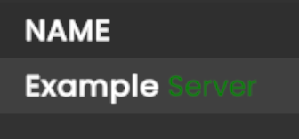

# Puck Dedicated Server | SteamCMD | Docker | Optimized for Unraid
This Dockerfile will download and install SteamCMD and the Puck Dedicated Server (PuckDS).

**ATTENTION:** First startup can take a few minutes while the container updates, downloads, and installs SteamCMD and the relevant game server files.

**INFO:** You can run multiple servers with only one SteadCMD directory. Be sure to modify the `SERVER_DIR`, `GAME_PORT`, and `PING_PORT` variable values as those can't be reused.

## Template ENV Variables for PuckDS
| Name            | Description                                      | Default/Example Value   |
|-----------------|--------------------------------------------------|-------------------------|
| STEAMCMD_DIR    | Directory where SteamCMD is installed            | /serverdata/steamcmd    |
| SERVER_DIR      | Directory where the game server files are stored | /serverdata/serverfiles |
| GAME_NAME       | The name of your game server                     | My Puck Server          |
| GAME_PASSWRD    | Password for joining the server (if desired)     | supersecret             |
| GAME_PORT       | Main game port                                   | 7777                    |
| PING_PORT       | Ping/Query port                                  | 7778                    |
| MAX_PLAYERS     | Maximum number of players allowed                | 10                      |
| VOIP            | Enable in-game voice chat                        | false                   |
| IS_PUBLIC       | Whether the server is publicly listed            | true                    |
| ADMIN_ID        | Comma-separated list of Steam Admin IDs          | 76561198237976801       |
| START_PAUSE     | Whether the game match starts in paused state    | false                   |
| ALLOW_VOTE      | Enable or disable voting in-game                 | true                    |
| GAME_ID         | Steam Game App ID (Don't change)                 | 3481440                 |
| VALIDATE        | Force validation of server files                 | true                    |
| TARGET_FR       | Target server frame rate                         | 120                     |
| SERVER_TR       | Server tick rate                                 | 100                     |
| CLIENT_TR       | Client tick rate                                 | 200                     |
| RELOAD_BAN_ID   | Reload ban IDs on container restart              | false                   |
| USE_PUCK_BAN_ID | Use Puck's official ban list                     | true                    |
| PRINT_METRIC    | Print server performance metrics                 | true                    |
| KICK_TO         | Kick timeout (seconds)                           | 300                     |
| SLEEP_TO        | Server sleep timeout (seconds)                   | 60                      |
| JOIN_MM_DELAY   | Matchmaking join delay (seconds)                 | 10                      |
| USERNAME        | Steam username for login (if desired)            | steamuser               |
| PASSWRD         | Steam password for login (if desired)            | password (Avoid ,|$"'#) |

**NOTE:** The `USERNAME` and `PASSWRD` variables are **NOT** required. Authentication for the SteamCMD portion is done anonymously. If you choose to still login with your username/password, then remember that Steam Guard needs to be disabled so it is highly advised to use an ALT Account. **DO NOT** disable Steam Guard on your primary Steam account.

### Server Name Text Formatting
If you'd like to add color, bold, or italic formats to the name of your server (shown in the server list in-game) then you'll need to modify `server_configuration.json` once the server has been ran at least once.

1. From your server, navigate to the location of your game server files (e.g. /mnt/user/appdata/puck)
2. Open `server_configuration.json` in your favorite text editor.
3. To apply specific colors or text formatting, modify the GAME_NAME variables value to something similar to this:

`<b><color=white>Example</color> <color=#008000ff>Server</color></b>`

This is the result:


**Note:** Refer to reference 4 below for more details on what colors and styles are supported.

## Run example
```bash
docker run -d --name='Puck' --net='host' --pids-limit 2048 \
  -p 7777:7777/udp -p 7778:7778/udp \
  -e 'GAME_NAME'='BigPucks' \
  -e 'GAME_PASSWRD'='password' \
  -e 'GAME_PORT'='7777' \
  -e 'PING_PORT'='7778' \
  -e 'MAX_PLAYERS'='12' \
  -e 'VOIP'='true' \
  -e 'IS_PUBLIC'='true' \
  -e 'ADMIN_ID'='76561198237976801' \
  -e 'VALIDATE'='' \
  -e 'USERNAME'='' \
  -e 'PASSWRD'='' \
  -e 'GAME_ID'='3481440' \
  -e 'TARGET_FR'='240' \
  -e 'SERVER_TR'='300' \
  -e 'CLIENT_TR'='300' \
  -e 'RELOAD_BAN_ID'='true' \
  -e 'USE_PUCK_BAN_ID'='true' \
  -e 'PRINT_METRIC'='true' \
  -e 'KICK_TO'='300' \
  -e 'JOIN_MM_DELAY'='10' \
  -e 'ALLOW_VOTE'='true' \
  -e 'START_PAUSE'='false' \
  -e 'SLEEP_TO'='60' \
  -v '/path/to/steamcmd':'/serverdata/steamcmd':'rw' \
  -v '/path/to/puck':'/serverdata/serverfiles':'rw' \
  'bgubs/puck-steamcmd:latest'
```

This Docker was mainly edited for better use with Unraid, if you don't use Unraid you should definitely try it!

A lot of this work was already done by [ich777](https://github.com/ich777) and [damianisaacs](https://hub.docker.com/r/damianisaacs). I just modified and updated the projects for my use case so big thanks to both of you!

### References
1. [ich777 - docker-steamcmd-server](https://github.com/ich777/docker-steamcmd-server)
2. [damianisaacs - steamcmdpuckserver](https://hub.docker.com/r/damianisaacs/steamcmdpuckserver)
3. [Puck Guide](https://codionca.github.io/PuckGuide)
4. [Unity Rich Text Tags](https://docs.unity3d.com/Packages/com.unity.ugui@1.0/manual/StyledText.html)
